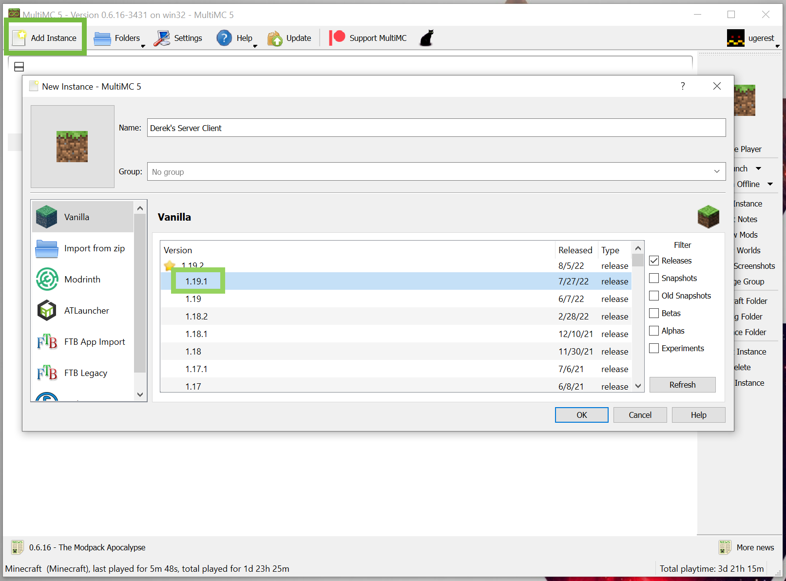
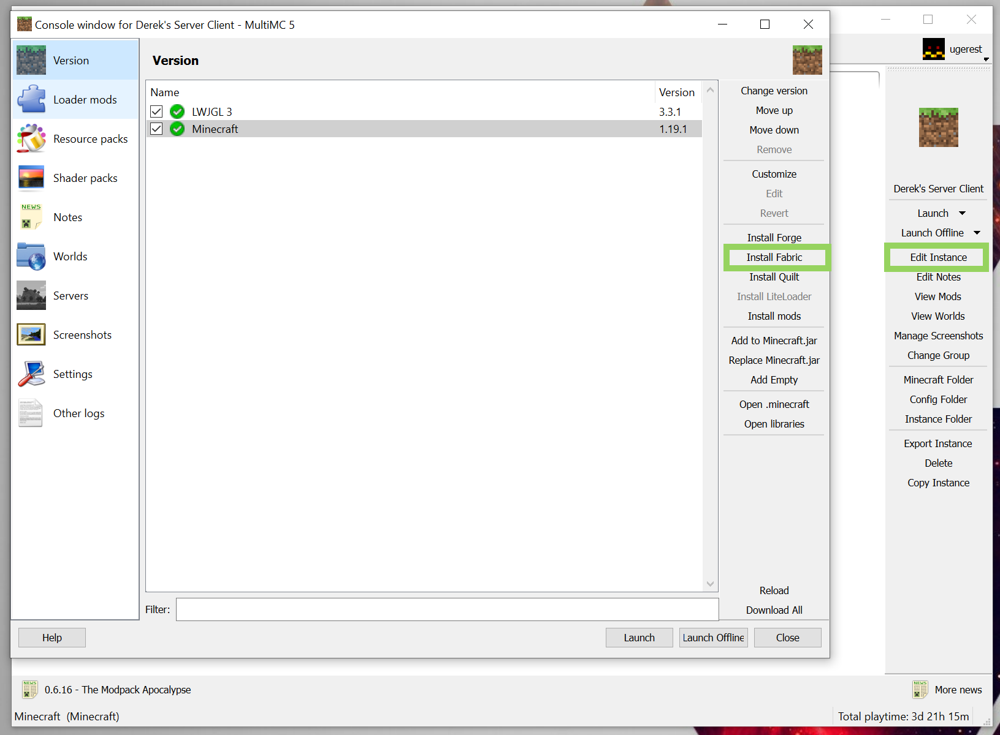
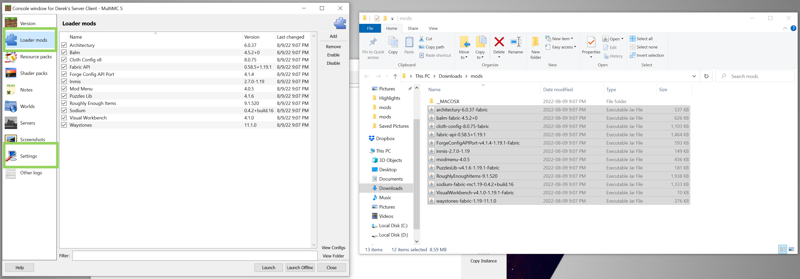

# MultiMC

You can find [MultiMC](https://multimc.org/) available for download on their [https://multimc.org/](https://multimc.org/).

## Instances

Add a new instance with the correct version for the server e.g. `1.9.1`.

## Install Fabric

I use Fabric as the modloader if you press edit instance, you can find the button to Install Fabric on the *Version*
tab.

## Copy the Mods

Copy the mods from the supplied `zip` file. Message me directly or check discord for the link to the `zip`. You'll
want to unzip the file and copy all the `.jar` files into the *Loader Mods* tab.

